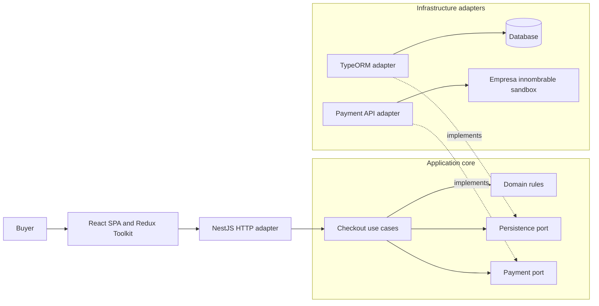
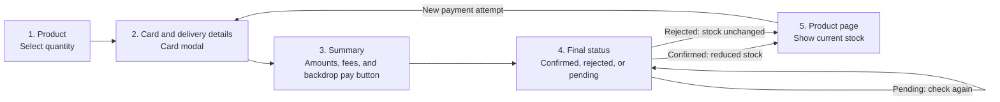
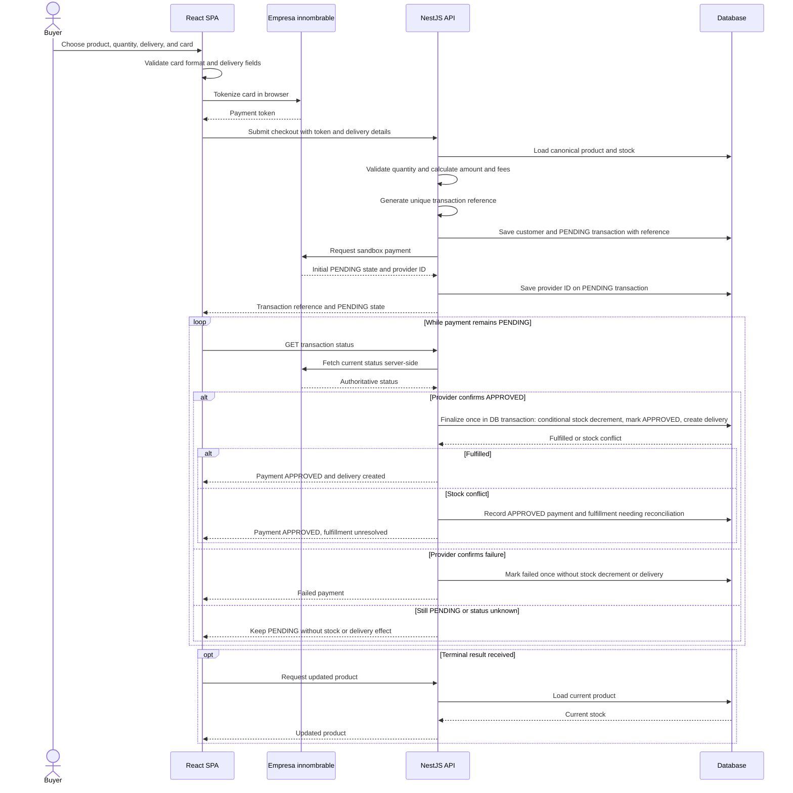
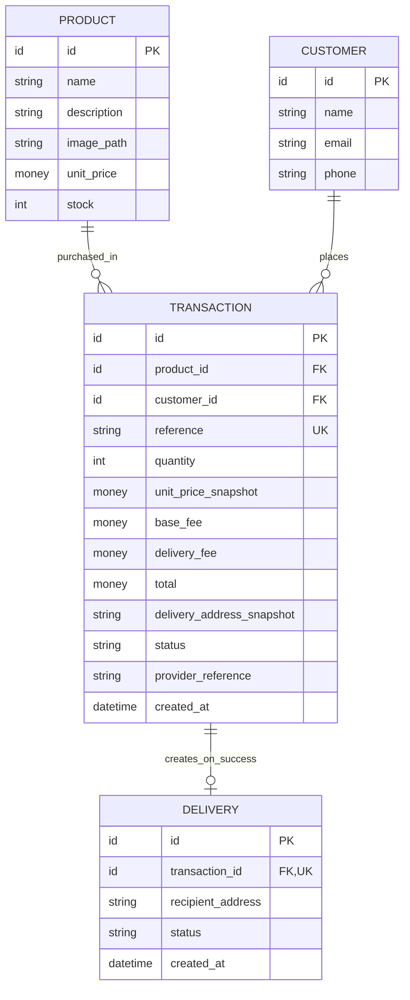
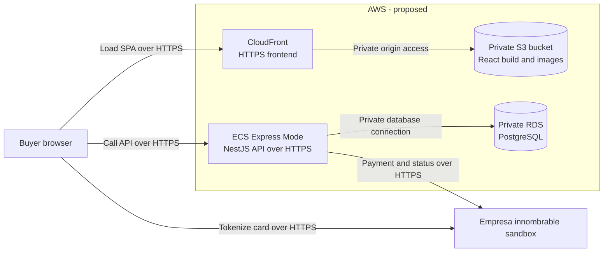

# Product Payment

This repository currently contains a React/Vite frontend scaffold and a NestJS backend scaffold. Checkout, persistence, payment integration, and deployment are **not implemented yet**. The diagrams below describe the intended solution, not the current runtime behavior.

## 1. Application architecture (proposed)

The checkout use cases own business decisions. NestJS translates HTTP requests; TypeORM and the payment integration remain outside the application core. Solid arrows show runtime calls, while dashed arrows show adapters implementing core-owned ports.

The database engine, exact ports, and endpoint contracts will be finalized during implementation. The core must not import NestJS, TypeORM, or payment-provider types.

## 2. Buyer journey (proposed)

The five screens follow the technical brief. Card entry is a modal within the second screen, not an extra screen. Card and delivery fields must be validated. The buyer chooses a quantity; the server remains authoritative for price, fees, stock, and payment status.

After a refresh, only non-sensitive checkout progress may be restored. Card details must be entered again. A pending or unknown outcome must not be presented as a rejection or a successful delivery.

## 3. Payment and fulfillment sequence (proposed)

The provider's verified outcome—not the browser or an HTTP timeout—controls fulfillment. This sequence shows the pending path with bounded browser polling of **our API**, never the provider. If payment creation returns a terminal outcome, the API applies the same finalization rules before responding. Authenticated provider notifications are another possible integration path, not an implemented feature.

External payment and local database writes cannot be one database transaction. A unique transaction reference is created before the provider request, but uniqueness alone does not guarantee safe provider retries. Finalization must be idempotent under repeated status checks, and concurrent stock updates and partial failures need tests and reconciliation. Payment status and fulfillment status are distinct: an approved charge with unavailable stock remains approved but must not claim a delivery. Raw card data must never be stored in the application database or logs.

The brief groups stock and delivery updates under both completed and failed outcomes. This proposal deliberately applies those effects only after confirmed success; a failed payment must not create a delivery or reduce stock.

## 4. Conceptual data model (proposed)

This is a business model, not a migration or a choice of database-specific types. A transaction records the selected product and a price/fee snapshot. Delivery details can be retained as non-card checkout data while payment is pending, but a **delivery record exists only after confirmed success**.

The authoritative price and stock live on the server. `money` and `id` denote concepts; their storage types, currency precision, constraints, and migration strategy remain to be selected. Failed or unresolved payments have no delivery record and do not decrement stock.

## Image handling (proposed)

The brief evaluates images for fast rendering and staying within UI boundaries; it does not require a particular product photo or screenshot. We propose a product image referenced by an optional `image_path` and served as a static frontend asset, without an image-upload service. Use an appropriately sized, compressed file, preserve aspect ratio, reserve layout space, and provide meaningful alternative text. Check the result at the brief's smallest reference viewport and across wider screens. Image sourcing and the exact format remain undecided.

## 5. AWS deployment topology (proposed)

This is a deployment proposal, **not an existing AWS environment**. The diagram shows only runtime traffic. The React build is static, so it does not need a production frontend container. The only application container runs NestJS; PostgreSQL is proposed as a managed, non-public database rather than a production database container.

CloudFront would serve the SPA from S3 with origin access control. ECS Express Mode would provide the public HTTPS API endpoint while managing its underlying load balancer and compute; the API alone would reach RDS through restricted VPC networking. Because the SPA and API use separate HTTPS origins, their eventual CSP and CORS settings must be verified together; the SPA's CSP must also allow card tokenization with the provider. No raw card data should pass through the API.

Deployment automation is **not implemented**: current GitHub Actions only checks pull requests. A later workflow could use short-lived OIDC credentials to upload the React build to S3, push the API image to ECR, and update the ECS service. Before provisioning, verify service availability, regional pricing, and credit eligibility in the actual AWS Free Plan account; the USD 100 credit is not a guarantee that this topology is free. Keep resource sizes small and configure a budget alert. No AWS resources, public URLs, or cloud costs have been verified yet.

AWS references: [private S3 origin with CloudFront](https://docs.aws.amazon.com/AmazonCloudFront/latest/DeveloperGuide/private-content-restricting-access-to-s3.html), [ECS Express Mode](https://docs.aws.amazon.com/AmazonECS/latest/developerguide/express-service-overview.html), and [RDS in a VPC](https://docs.aws.amazon.com/AmazonRDS/latest/UserGuide/USER_VPC.WorkingWithRDSInstanceinaVPC.html).
