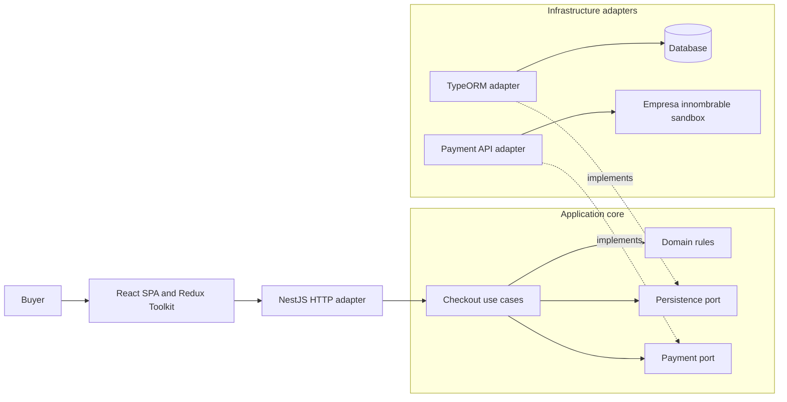
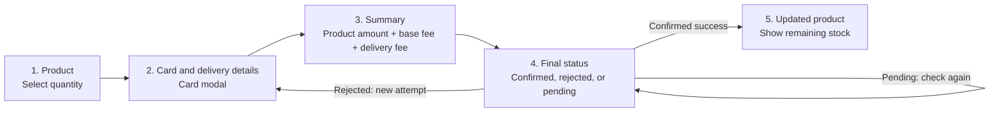
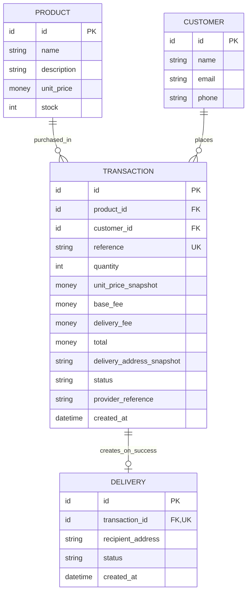

# Product Payment

This repository currently contains a React/Vite frontend scaffold and a NestJS backend scaffold. Checkout, persistence, payment integration, and deployment are **not implemented yet**. The four diagrams below describe the intended solution, not the current runtime behavior.

## 1. Application architecture (proposed)

The checkout use cases own business decisions. NestJS translates HTTP requests; TypeORM and the payment integration remain outside the application core. Solid arrows show runtime calls, while dashed arrows show adapters implementing core-owned ports.



The database engine, exact ports, and endpoint contracts will be finalized during implementation. The core must not import NestJS, TypeORM, or payment-provider types.

## 2. Buyer journey (proposed)

The five screens follow the technical brief. Card entry is a modal within the second screen, not an extra screen. The buyer chooses a quantity; the server remains authoritative for price, fees, stock, and payment status.



After a refresh, only non-sensitive checkout progress may be restored. Card details must be entered again. A pending or unknown outcome must not be presented as a rejection or a successful delivery.

## 3. Payment and fulfillment sequence (proposed)

The provider's verified outcome—not the browser or an HTTP timeout—controls fulfillment. The final-status screen may need to check again while a payment is pending. The mechanism for receiving provider updates (notification or server-side query) remains an implementation decision.

```mermaid
sequenceDiagram
    actor Buyer
    participant SPA as React SPA
    participant Provider as Empresa innombrable
    participant API as NestJS API
    participant DB as Database

    Buyer->>SPA: Choose product, quantity, delivery, and card
    SPA->>Provider: Tokenize card in browser
    Provider-->>SPA: Payment token
    SPA->>API: Submit checkout with token and delivery details
    API->>DB: Load canonical product and stock
    API->>API: Validate quantity and calculate amount and fees
    API->>DB: Save customer and PENDING transaction with reference
    API->>Provider: Request sandbox payment
    Provider-->>API: Initial payment state
    API-->>SPA: Transaction reference and current state

    Note over Provider,API: Provider update or server-side status query; verify final status
    API->>Provider: Verify transaction status when needed
    Provider-->>API: Authoritative status

    alt Confirmed success and stock available
        API->>DB: Atomically mark success, decrement stock, create one delivery
        DB-->>API: Commit result
        API-->>SPA: Confirmed status
        SPA->>API: Request updated product
        API->>DB: Load current product
        DB-->>API: Remaining stock
        API-->>SPA: Updated product
    else Confirmed rejection
        API->>DB: Mark rejected; do not change stock or create delivery
        API-->>SPA: Rejected status
    else Pending or unknown
        API-->>SPA: Keep pending; no stock or delivery effect
    else Confirmed success but stock conflict
        API->>DB: Record exception for reconciliation; no delivery
        API-->>SPA: Unresolved status; do not claim fulfillment
    end
```

External payment and local database writes cannot be one database transaction. Idempotency, concurrent stock updates, and reconciliation after partial failure must be designed and tested before implementation is considered complete. Raw card data must never be stored in the application database or logs.

## 4. Conceptual data model (proposed)

This is a business model, not a migration or a choice of database-specific types. A transaction records the selected product and a price/fee snapshot. Delivery details can be retained as non-card checkout data while payment is pending, but a **delivery record exists only after confirmed success**.



The authoritative price and stock live on the server. `money` and `id` denote concepts; their storage types, currency precision, constraints, and migration strategy remain to be selected. Failed or unresolved payments have no delivery record and do not decrement stock.
