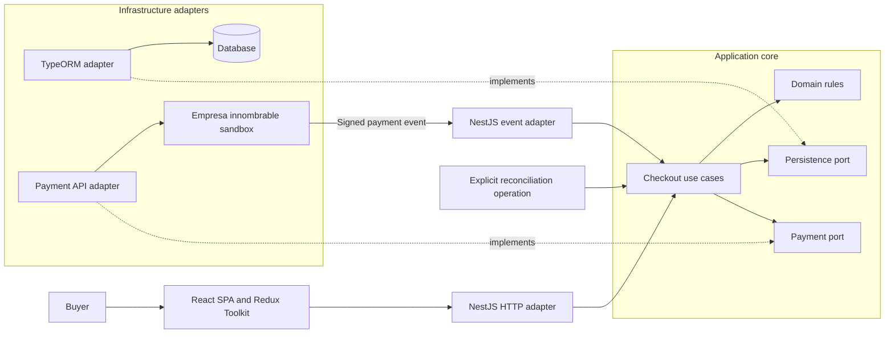
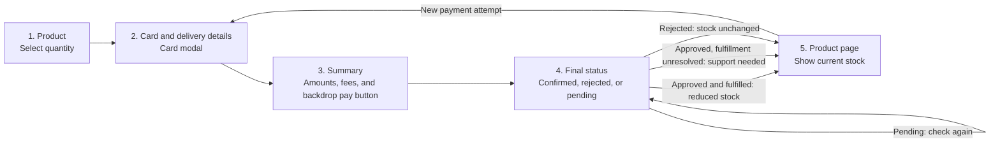
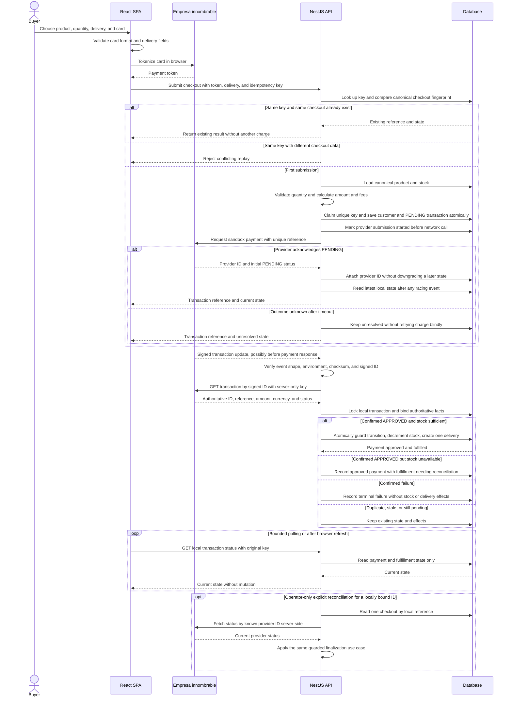
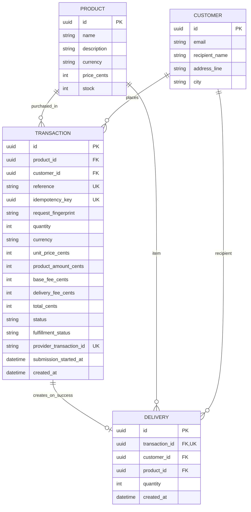
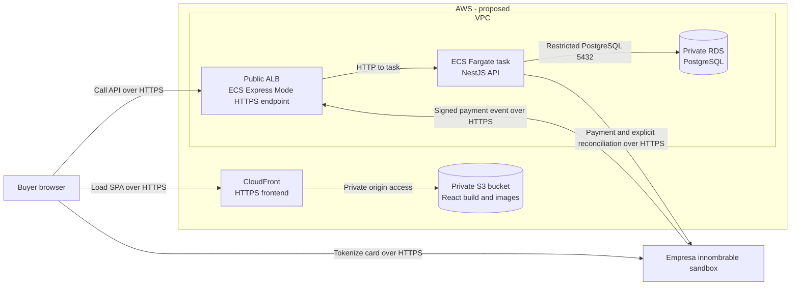

# Product Payment

This repository contains a React/Vite frontend scaffold and a NestJS backend. The backend implements product reads, idempotent PENDING checkout initiation, signed payment-event verification, authoritative server-side status lookup, atomic confirmed-payment finalization, local payment/fulfillment status reads, and an operator-only known-ID reconciliation command. See the [backend setup and API contract](backend/README.md). These backend paths have fake and PostgreSQL tests; live final approval, a deployed callback, the frontend checkout, and AWS deployment remain unverified or unimplemented. The diagrams show the intended full solution; annotations below distinguish current backend behavior from proposed UI and deployment.

## 1. Application architecture (proposed)

The checkout use cases own business decisions. NestJS translates buyer requests and signed payment events; TypeORM and the payment integration remain outside the application core. Solid arrows show runtime calls, while dashed arrows show adapters implementing core-owned ports.

PostgreSQL and TypeORM implement product reads, PENDING checkout persistence, and atomic confirmed-payment/fulfillment effects. The application core owns checkout, payment-submission, status-reading, and finalization contracts; Nest HTTP and outbound adapters are composed at the edge. Signed-event ingress and an explicit operator reconciliation path are implemented; the browser journey is not. Implemented routes and limitations are documented in the [backend README](backend/README.md). The core must not import NestJS, TypeORM, or payment-provider types.

## 2. Buyer journey (proposed)

The five screens follow the technical brief. Card entry is a modal within the second screen, not an extra screen. Card and delivery fields must be validated. The buyer chooses a quantity; the server remains authoritative for price, fees, stock, and payment status.

After a refresh, only non-sensitive checkout progress may be restored. Card details must be entered again. A pending or unknown outcome must not be presented as a rejection or a successful delivery.

## 3. Payment and fulfillment sequence (proposed)

The provider's verified outcome—not the browser or an HTTP timeout—controls fulfillment. The backend implements signed-event-triggered authoritative lookup, atomic finalization, read-only local status, and a separate operator-only reconciliation command for a known, locally bound provider ID. The frontend journey, deployed callback, and live final approval remain pending. Bounded browser polling, when implemented, will read **our local API state** only. Initial payment submission currently accepts only a matching `201`/`PENDING`; a terminal initiation response is not interpreted as confirmed success.

Idempotency has two boundaries. Repeating the same checkout key and canonical business-data fingerprint returns its original transaction, even if the product price later changes; reusing the key with different checkout data is a conflict. The fingerprint does not contain the transient payment token. A database unique constraint resolves concurrent first submissions, and a durable submission claim prevents concurrent requests from sending another charge. A timeout after sending and before receiving the provider ID remains **unknown**. A unique reference or duplicate-reference error does not prove that a second provider POST is safe. A signed event may recover the result by reference; otherwise reconcile through a documented provider capability or manual investigation, never an automatic blind retry. The payment token is transient input, not persisted checkout state.

External payment and local database writes cannot be one transaction. The persistence adapter atomically creates PENDING checkouts and durably claims one provider submission before network I/O. Finalization uses one PostgreSQL transaction to lock the checkout, bind authoritative facts, conditionally decrement sufficient stock, and enforce at most one delivery. Duplicate or out-of-order events cannot repeat effects. A provider success that cannot be persisted remains eligible for event retry or explicit reconciliation; event delivery alone is not an unlimited guarantee. The operator command reconciles one checkout with a known, locally bound provider ID independently of the browser; attempts without an ID require a verified event or manual investigation unless a supported lookup is confirmed. Payment and fulfillment status remain distinct: an approved charge with unavailable stock does not claim a delivery. The implemented local status `GET` reads only; it never triggers provider calls or fulfillment writes. Raw card data must never be stored in the application database or logs.

The brief groups stock and delivery updates under both completed and failed outcomes. This proposal deliberately applies those effects only after confirmed success; a failed payment must not create a delivery or reduce stock.

The implemented HTTP surface includes `GET /products/:id`, `GET /checkout/quote`, `GET /checkout/consents`, `POST /checkouts`, `GET /transactions/:reference`, and signed `POST /payment/events` (the scaffold's `GET /` remains). Customer and delivery data are managed internally, not exposed as public CRUD endpoints. The status lookup requires the original idempotency key and returns only reference, payment status, and fulfillment status; stronger access control is needed before public deployment. Confirmed fulfillment is internal, with no buyer delivery CRUD endpoint. Reconciliation is an operator CLI, not a public route. Local Swagger UI is available at `http://localhost:3000/api` and OpenAPI JSON at `http://localhost:3000/api-json` while the backend runs; a **public** API documentation link remains pending deployment and verification.

Backend tests cover duplicate and concurrent checkout submissions, a replay with changed data, timeout before provider ID, signed-event replay and reordering, approval after stock depletion, and local rollback on delivery insertion failure. Unit tests cover use-case policy; PostgreSQL integration tests prove atomicity and uniqueness. Live terminal-provider behavior and deployed callback remain unverified. Jest coverage is measured separately for backend and frontend before claiming the brief's greater-than-80% target.

## 4. Current backend data model

This summarizes the implemented PostgreSQL schema. A transaction stores the selected product and price/fee snapshot. Recipient and address details remain on the customer row while payment is pending; a **delivery row exists only after confirmed approval with sufficient stock**.

The authoritative price and stock live on the server. Amounts are integer COP cents, IDs are UUIDs, and the reference and idempotency key are unique. The provider transaction ID and submission timestamp may be null while an attempt is unresolved. A delivery's transaction ID is unique; finalization conditionally decrements stock only for confirmed approval with sufficient stock. The separate image proposal below is not part of this schema.

## Image handling (proposed)

The brief evaluates images for fast rendering and staying within UI boundaries; it does not require a particular product photo or screenshot. We propose a product image referenced by frontend configuration and served as a static asset, without a database image column or upload service. Use an appropriately sized, compressed file, preserve aspect ratio, reserve layout space, and provide meaningful alternative text. Check the result at the brief's smallest reference viewport and across wider screens. Image sourcing and the exact format remain undecided.

## 5. AWS deployment topology (proposed)

This is a deployment proposal, **not an existing AWS environment**. The diagram shows only runtime traffic. The React build is static, so it does not need a production frontend container. The only application container runs NestJS; PostgreSQL is proposed as a managed, non-public database rather than a production database container.

CloudFront would serve the SPA from S3 with origin access control. ECS Express Mode would create an internet-facing ALB and a Fargate task in the default VPC's public subnets. Public HTTPS terminates at the ALB; its target connection to the NestJS task uses HTTP by default. Restrict task ingress to the ALB and keep RDS non-public, in the same VPC, with PostgreSQL port 5432 open only from the task's security group. The task needs outbound HTTPS access to the payment provider; the public event endpoint must verify its signature and transaction identity before any state change. This public-subnet proposal avoids a NAT gateway; moving the task to private subnets would require revisiting both public ingress and internet egress. Because the SPA and API use separate HTTPS origins, their eventual CSP and CORS settings must be verified together; the SPA's CSP must also allow card tokenization with the provider. No raw card data should pass through the API.

Before deployment, configure an SPA route fallback to `index.html` for browser refreshes, supply database and provider credentials through a secret mechanism rather than the image or frontend build, and verify the actual TLS, headers, and security-group rules. These operational details are intentionally not extra boxes in the runtime diagram.

Deployment automation is **not implemented**: current GitHub Actions only checks pull requests. A later workflow could use short-lived OIDC credentials to upload the React build to S3, push the API image to ECR, and update the ECS service. Before provisioning, verify service availability, regional pricing, and credit eligibility in the actual AWS Free Plan account; the USD 100 credit is not a guarantee that this topology is free. Keep resource sizes small and configure a budget alert. No AWS resources, public URLs, or cloud costs have been verified yet.

AWS references: [private S3 origin with CloudFront](https://docs.aws.amazon.com/AmazonCloudFront/latest/DeveloperGuide/private-content-restricting-access-to-s3.html), [ECS Express Mode network and target defaults](https://docs.aws.amazon.com/AmazonECS/latest/developerguide/express-service-work.html), and [RDS security groups](https://docs.aws.amazon.com/AmazonRDS/latest/gettingstartedguide/security-groups.html).
