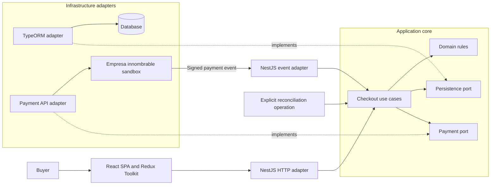
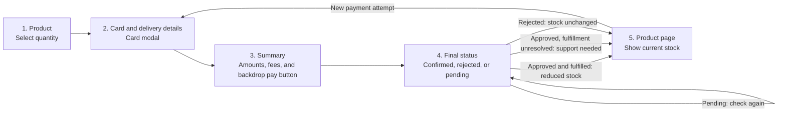
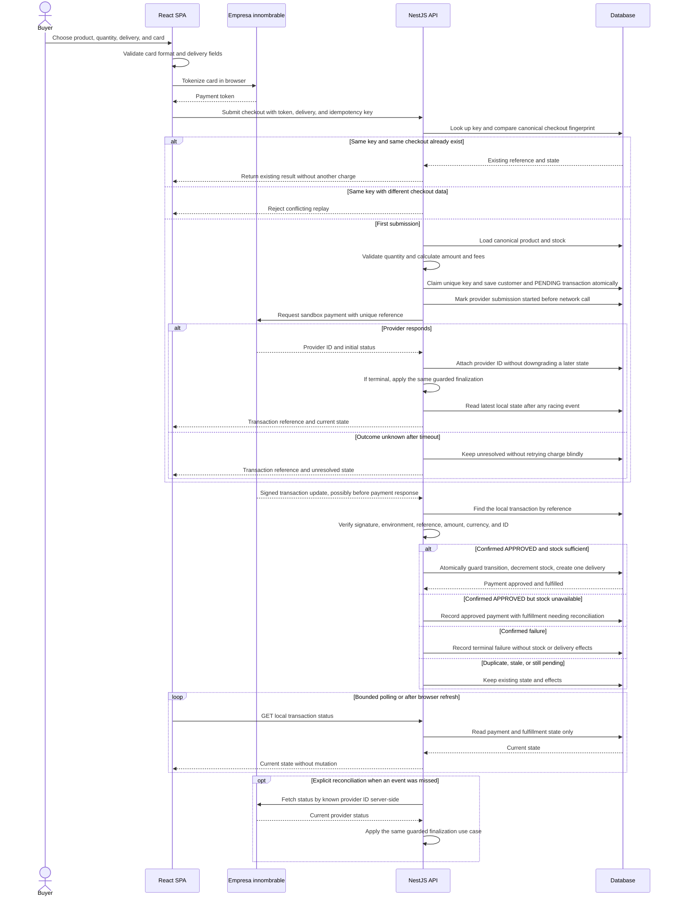
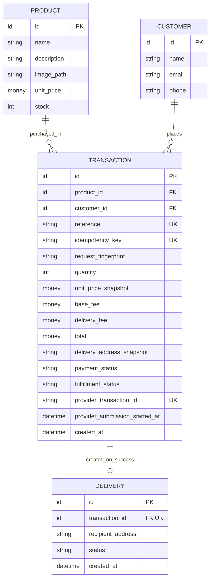
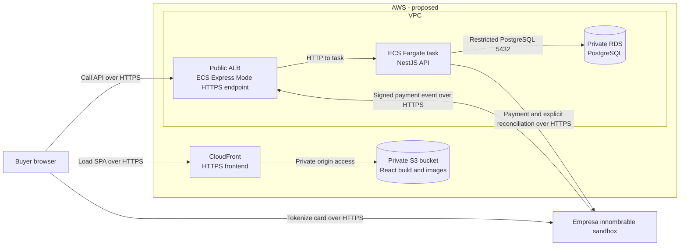

# Product Payment

This repository currently contains a React/Vite frontend scaffold and a NestJS backend scaffold. Checkout, persistence, payment integration, and deployment are **not implemented yet**. The diagrams below describe the intended solution, not the current runtime behavior.

## 1. Application architecture (proposed)

The checkout use cases own business decisions. NestJS translates buyer requests and signed payment events; TypeORM and the payment integration remain outside the application core. Solid arrows show runtime calls, while dashed arrows show adapters implementing core-owned ports.

PostgreSQL and TypeORM are the selected backend direction, not installed behavior. Exact ports and endpoint contracts will be finalized during implementation. The core must not import NestJS, TypeORM, or payment-provider types. Event authentication and HTTP mapping belong to inbound adapters; payment and persistence calls go through core-owned outbound ports.

## 2. Buyer journey (proposed)

The five screens follow the technical brief. Card entry is a modal within the second screen, not an extra screen. Card and delivery fields must be validated. The buyer chooses a quantity; the server remains authoritative for price, fees, stock, and payment status.

After a refresh, only non-sensitive checkout progress may be restored. Card details must be entered again. A pending or unknown outcome must not be presented as a rejection or a successful delivery.

## 3. Payment and fulfillment sequence (proposed)

The provider's verified outcome—not the browser or an HTTP timeout—controls fulfillment. A signed provider event is the primary finalization trigger; an explicit server-side reconciliation operation is the fallback. Bounded browser polling reads **our local API state** only. If payment creation returns a terminal outcome, the API applies the same finalization rules before responding. None of these paths is implemented yet.

Idempotency has two boundaries. Repeating the same checkout key and canonical business-data fingerprint returns its original transaction, even if the product price later changes; reusing the key with different checkout data is a conflict. The fingerprint does not contain the transient payment token. A database unique constraint resolves concurrent first submissions, and a durable submission claim prevents concurrent requests from sending another charge. A timeout after sending and before receiving the provider ID remains **unknown**. A unique reference or duplicate-reference error does not prove that a second provider POST is safe. A signed event may recover the result by reference; otherwise reconcile through a documented provider capability or manual investigation, never an automatic blind retry. The payment token is transient input, not persisted checkout state.

External payment and local database writes cannot be one transaction. The application use case owns allowed transitions and fulfillment policy; its persistence port offers atomic finalization. The TypeORM adapter implements that capability in one PostgreSQL transaction, guarding the transaction row, conditionally decrementing sufficient stock, enforcing at most one delivery, and returning a typed stock-conflict result. Duplicate or out-of-order events return the already recorded result without repeating effects. A provider success that cannot be persisted must remain eligible for reconciliation; event delivery alone is not an unlimited guarantee. A small backend reconciliation pass can check unresolved attempts with known provider IDs independently of the browser; attempts without an ID require a verified event or manual investigation unless a supported lookup is confirmed. Payment status and fulfillment status are distinct: an approved charge with unavailable stock remains approved but must not claim a delivery. A local status `GET` must never trigger provider calls or fulfillment writes. Raw card data must never be stored in the application database or logs.

The brief groups stock and delivery updates under both completed and failed outcomes. This proposal deliberately applies those effects only after confirmed success; a failed payment must not create a delivery or reduce stock.

The proposed HTTP surface includes product/stock reads, a server-priced checkout quote, checkout submission, a read-only transaction-status lookup, and a signed event receiver. Customer and delivery data are managed through the checkout lifecycle, not exposed as unauthenticated public CRUD endpoints. Exact paths, validation, access rules for status lookup, and public Swagger URL remain to be defined and verified during implementation.

Planned verification includes duplicate and concurrent checkout submissions, a replay with changed data, timeout before provider ID, signed-event replay and reordering, approval after stock depletion, and local persistence failure after provider approval. Unit tests cover use-case policy; PostgreSQL integration tests must prove atomicity and uniqueness. Jest coverage is measured separately for backend and frontend before claiming the brief's greater-than-80% target.

## 4. Conceptual data model (proposed)

This is a business model, not a migration or a choice of database-specific types. A transaction records the selected product and a price/fee snapshot. Delivery details can be retained as non-card checkout data while payment is pending, but a **delivery record exists only after confirmed success**.

The authoritative price and stock live on the server. `money` and `id` denote concepts; their storage types, currency precision, constraints, and migration strategy remain to be selected. The local payment state must distinguish pending, unknown, approved, and failed outcomes; fulfillment has its own state. A null provider ID is possible while an external submission is unresolved. Failed or unresolved payments have no delivery record and do not decrement stock. The delivery relation and idempotency key require database uniqueness; exact column/index definitions remain implementation decisions.

## Image handling (proposed)

The brief evaluates images for fast rendering and staying within UI boundaries; it does not require a particular product photo or screenshot. We propose a product image referenced by an optional `image_path` and served as a static frontend asset, without an image-upload service. Use an appropriately sized, compressed file, preserve aspect ratio, reserve layout space, and provide meaningful alternative text. Check the result at the brief's smallest reference viewport and across wider screens. Image sourcing and the exact format remain undecided.

## 5. AWS deployment topology (proposed)

This is a deployment proposal, **not an existing AWS environment**. The diagram shows only runtime traffic. The React build is static, so it does not need a production frontend container. The only application container runs NestJS; PostgreSQL is proposed as a managed, non-public database rather than a production database container.

CloudFront would serve the SPA from S3 with origin access control. ECS Express Mode would create an internet-facing ALB and a Fargate task in the default VPC's public subnets. Public HTTPS terminates at the ALB; its target connection to the NestJS task uses HTTP by default. Restrict task ingress to the ALB and keep RDS non-public, in the same VPC, with PostgreSQL port 5432 open only from the task's security group. The task needs outbound HTTPS access to the payment provider; the public event endpoint must verify its signature and transaction identity before any state change. This public-subnet proposal avoids a NAT gateway; moving the task to private subnets would require revisiting both public ingress and internet egress. Because the SPA and API use separate HTTPS origins, their eventual CSP and CORS settings must be verified together; the SPA's CSP must also allow card tokenization with the provider. No raw card data should pass through the API.

Before deployment, configure an SPA route fallback to `index.html` for browser refreshes, supply database and provider credentials through a secret mechanism rather than the image or frontend build, and verify the actual TLS, headers, and security-group rules. These operational details are intentionally not extra boxes in the runtime diagram.

Deployment automation is **not implemented**: current GitHub Actions only checks pull requests. A later workflow could use short-lived OIDC credentials to upload the React build to S3, push the API image to ECR, and update the ECS service. Before provisioning, verify service availability, regional pricing, and credit eligibility in the actual AWS Free Plan account; the USD 100 credit is not a guarantee that this topology is free. Keep resource sizes small and configure a budget alert. No AWS resources, public URLs, or cloud costs have been verified yet.

AWS references: [private S3 origin with CloudFront](https://docs.aws.amazon.com/AmazonCloudFront/latest/DeveloperGuide/private-content-restricting-access-to-s3.html), [ECS Express Mode network and target defaults](https://docs.aws.amazon.com/AmazonECS/latest/developerguide/express-service-work.html), and [RDS security groups](https://docs.aws.amazon.com/AmazonRDS/latest/gettingstartedguide/security-groups.html).
