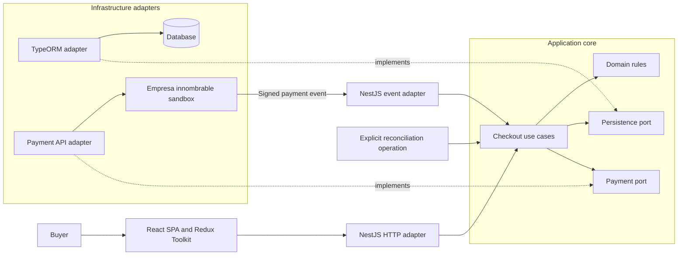
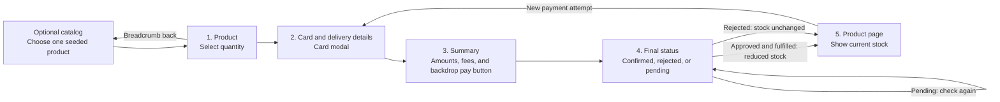
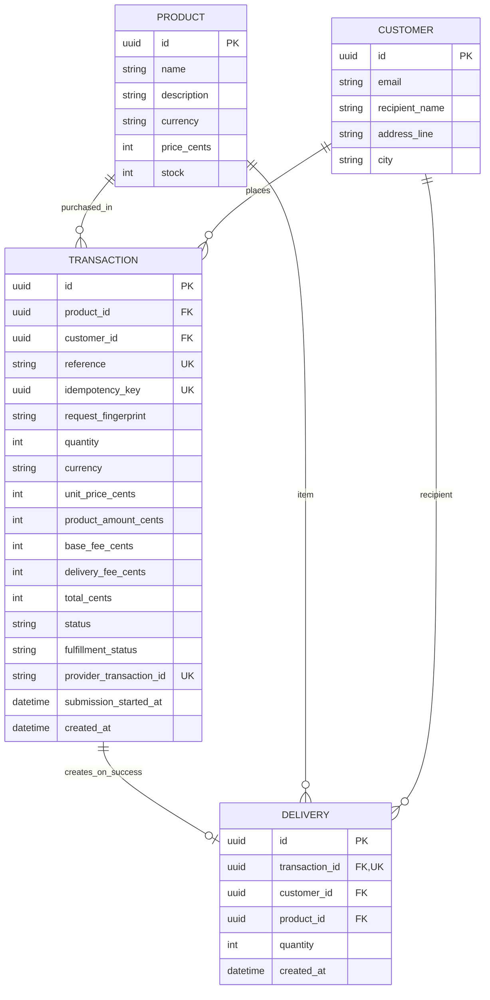
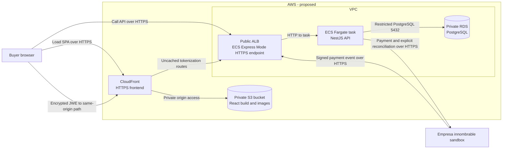

# Product Payment

This repository contains a React/Vite SPA and a NestJS backend. The SPA offers a ten-product demo catalog, one selected product at a time, a server-priced quote, a two-view gallery, a card/delivery modal with separate current consents and browser-side encrypted tokenization, a fee summary with explicit payment confirmation, and a status screen that can recover after refresh. The backend implements product reads, idempotent checkout initiation, signed payment-event verification, authoritative server-side status lookup, atomic confirmed-payment finalization, local status reads, and operator-only known-ID reconciliation. See the [frontend setup](frontend/README.md), [backend setup and API contract](backend/README.md), and [Postman collection](docs/product-payment.postman_collection.json). The collection is a repository artifact, not a hosted API URL; its checkout request requires locally supplied transient tokens and must never be exported with credentials. Local tests exercise the browser flow with mocked network responses and the backend with fake and PostgreSQL adapters. Live end-to-end terminal payment, a deployed callback, browser-provider interoperability, and AWS deployment remain unverified. The first three diagrams describe implemented local behavior; the cloud diagram is a proposal.

## 1. Application architecture (implemented locally)

The checkout use cases own business decisions. NestJS translates buyer requests and signed payment events; TypeORM and the payment integration remain outside the application core. Solid arrows show runtime calls, while dashed arrows show adapters implementing core-owned ports.

PostgreSQL and TypeORM implement product reads, pending checkout persistence, and atomic confirmed-payment/fulfillment effects. The application core owns checkout, payment-submission, status-reading, and finalization contracts and pure policy for authoritative fact binding, monotonic transitions, and fulfillment decisions. The TypeORM adapter executes the row lock and atomic writes; Nest HTTP and outbound adapters are composed at the edge. Signed-event ingress and an explicit operator reconciliation path are implemented. The SPA submits only after buyer confirmation and reads local status by the original idempotency key. Implemented routes and limitations are documented in the [backend README](backend/README.md). The core must not import NestJS, TypeORM, or payment-provider types.

## 2. Buyer journey (implemented locally)

The optional catalog is an added way to choose one of ten seeded products; it is not a cart or an extra checkout step. The required journey still has five steps for one selected product. Card entry is a modal within the second step, not an extra step. Card and delivery fields must be validated. The buyer chooses a quantity; the server remains authoritative for price, fees, stock, and payment status.

Before payment, refresh restores only the selected product ID and quantity from a validated `sessionStorage` allowlist; product and quote are re-fetched and card details/consents must be entered again. Before the payment POST, a separate versioned allowlist saves product ID, quantity, and the original random UUIDv4 idempotency key. Refresh on the status step uses that key with read-only `GET /checkouts/status`, never a new payment POST. Unreadable storage prevents a fresh payment attempt. Raw card fields, token, and consent evidence are never restored. A pending or unknown outcome must not be presented as a rejection or successful delivery; an approved payment without a created delivery remains trackable.

## 3. Payment and fulfillment sequence (implemented locally; live terminal outcome unverified)

The provider's verified outcome—not the browser, a `201`, or an HTTP timeout—controls fulfillment. The backend implements signed-event-triggered authoritative lookup, atomic finalization, read-only local status, and a separate operator-only reconciliation command for a known, locally bound provider ID. The SPA now submits from the explicit confirmation handler, persists the original key before POST, and performs at most three automatic status checks; later checks are buyer-triggered. It reads **our local API state** only. A lost POST response or refresh uses `GET /checkouts/status` with that same key and never blindly re-POSTs. Live terminal approval and a deployed callback remain unverified.

```mermaid
sequenceDiagram
    actor Buyer
    participant SPA as React SPA
    participant Provider as Empresa innombrable
    participant API as NestJS API
    participant DB as Database

    opt Browse the optional ten-product catalog
        SPA->>API: GET /products
        API->>DB: Read current products and stock
        DB-->>API: Product list
        API-->>SPA: Product list
        Buyer->>SPA: Choose one product
    end
    SPA->>API: GET /products/:id for the selected product
    API->>DB: Read current product and stock
    DB-->>API: Current product detail
    API-->>SPA: Current product detail
    Buyer->>SPA: Choose quantity for one product
    SPA->>API: GET /checkout/quote
    API-->>SPA: Server-priced quote
    Buyer->>SPA: Enter delivery and card details
    SPA->>API: GET /checkout/consents
    API-->>SPA: Current policy links, consent tokens, public key
    Buyer->>SPA: Explicitly accept both current consent documents
    SPA->>SPA: Validate card, delivery, and both consents
    SPA->>API: GET /checkout/tokenization-key
    API->>Provider: Fetch public encryption key
    Provider-->>API: Public encryption key
    API-->>SPA: Public encryption key only
    SPA->>SPA: Encrypt card details as compact JWE
    SPA->>API: POST /checkout/card-tokens with compact JWE only
    API->>Provider: Relay compact JWE for tokenization
    Provider-->>API: Opaque card token
    API-->>SPA: Opaque card token only
    SPA->>API: GET /checkout/quote before summary
    API-->>SPA: Refreshed server-priced quote
    SPA-->>Buyer: Show fee summary and final confirmation dialog
    Buyer->>SPA: Explicitly confirm and pay
    SPA->>SPA: Save original UUIDv4 key, product ID, and quantity in sessionStorage
    SPA->>API: POST /checkouts with token, delivery, expectedTotalCents, and Idempotency-Key
    API->>DB: Look up key and compare canonical checkout fingerprint
    alt Same key and same checkout already exist
        DB-->>API: Existing reference and state
        API-->>SPA: Return existing result without another charge
    else Same key with different checkout data
        API-->>SPA: Reject conflicting replay
    else First submission
        API->>DB: Load canonical product and stock
        API->>API: Validate quantity and compare current total with expectedTotalCents
        alt Confirmed total changed
            API-->>SPA: 409 QUOTE_CHANGED without provider submission
        else Confirmed total matches
        API->>DB: Claim unique key and save customer and PENDING transaction atomically
        API->>DB: Mark provider submission started before network call
        API->>Provider: Request sandbox payment with unique reference
        alt Provider acknowledges PENDING
            Provider-->>API: Provider ID and initial PENDING status
            API->>DB: Attach provider ID without downgrading a later state
            API->>DB: Read latest local state after any racing event
            API-->>SPA: Transaction reference and current state
        else Outcome unknown after timeout
            API->>DB: Keep unresolved without retrying charge blindly
            API-->>SPA: Transaction reference and unresolved state
        end
        end
    end

    Provider-->>API: Signed transaction update, possibly before payment response
    API->>API: Verify event shape, environment, checksum, and signed ID
    API->>Provider: GET transaction by signed ID with server-only key
    Provider-->>API: Authoritative ID, reference, amount, currency, and status
    API->>DB: Lock local transaction and bind authoritative facts
    alt Confirmed APPROVED and stock sufficient
        API->>DB: Atomically guard transition, decrement stock, create one delivery
        DB-->>API: Payment approved and fulfilled
    else Confirmed APPROVED but stock unavailable
        API->>DB: Record approved payment with fulfillment needing reconciliation
    else Confirmed failure
        API->>DB: Record terminal failure without stock or delivery effects
    else Duplicate, stale, or still pending
        API->>DB: Keep existing state and effects
    end

    loop Bounded polling, manual recheck, or after browser refresh
        SPA->>API: GET /checkouts/status with original Idempotency-Key
        API->>DB: Read payment and fulfillment state only
        DB-->>API: Current state
        API-->>SPA: Current state without mutation
    end

    opt Return to product after resolved outcome and safe fulfillment state
        SPA->>API: GET /products/:id
        API-->>SPA: Current stock, not an optimistic decrement
    end

    opt Operator-only explicit reconciliation for a locally bound ID
        API->>DB: Read one checkout by local reference
        API->>Provider: Fetch status by known provider ID server-side
        Provider-->>API: Current provider status
        API->>API: Apply the same guarded finalization use case
    end
```

Idempotency has two boundaries. The browser keeps one original key for the confirmed attempt, and the backend returns an existing transaction for a matching key and canonical business-data fingerprint—even if the product price later changes. Reusing the key with changed checkout data or expected total conflicts. A new first submission with a changed server total is rejected before persistence or provider I/O. The fingerprint does not contain the transient payment token. A database unique constraint resolves concurrent first submissions, and a durable submission claim prevents concurrent requests from sending another charge. A timeout after sending and before receiving the provider ID remains **unknown**. A unique reference or duplicate-reference error does not prove that a second provider POST is safe. A signed event may recover the result by reference; otherwise reconcile through a documented provider capability or manual investigation, never an automatic blind retry. The payment token is transient input, not persisted checkout state.

External payment and local database writes cannot be one transaction. The persistence adapter atomically creates PENDING checkouts and durably claims one provider submission before network I/O. Finalization uses one PostgreSQL transaction: the TypeORM adapter locks the checkout row and executes conditional stock and unique-delivery writes, while pure application-core policy decides authoritative fact binding, monotonic transitions, and fulfillment outcomes from the locked facts. Duplicate or out-of-order events cannot repeat effects. A provider success that cannot be persisted remains eligible for event retry or explicit reconciliation; event delivery alone is not an unlimited guarantee. The operator command reconciles one checkout with a known, locally bound provider ID independently of the browser; attempts without an ID require a verified event or manual investigation unless a supported lookup is confirmed. Payment and fulfillment status remain distinct: an approved charge with unavailable stock does not claim a delivery. The implemented local status `GET` reads only; it never triggers provider calls or fulfillment writes. Raw card data must never be stored in the application database or logs.

The brief groups stock and delivery updates under both completed and failed outcomes. The implementation deliberately applies those effects only after confirmed success; a failed payment must not create a delivery or reduce stock.

The implemented HTTP surface includes read-only `GET /products` (an array with current stock) and `GET /products/:id`, `GET /checkout/quote`, `GET /checkout/consents`, `POST /checkouts`, `GET /checkouts/status`, `GET /transactions/:reference`, and signed `POST /payment/events` (the scaffold's `GET /` remains). Customer and delivery data are managed internally, not exposed as public CRUD endpoints. Both status lookups require the original idempotency key and return only reference, payment status, and fulfillment status; stronger access control is needed before public deployment. Confirmed fulfillment is internal, with no buyer delivery CRUD endpoint. Reconciliation is an operator CLI, not a public route. The [Postman collection](docs/product-payment.postman_collection.json) is a local artifact; inspect the generated OpenAPI contract for the newest recovery route and quote precondition until the collection is synchronized. The signed event is provider-to-server and deliberately not represented as a manually runnable request. Local Swagger UI is available at `http://localhost:3000/api` and OpenAPI JSON at `http://localhost:3000/api-json` while the backend runs. Neither URL is public.

Local Jest evidence on 2026-09-27: `cd frontend && npm run test:coverage -- --runInBand` passed 112 tests in 15 suites with 92.92% statements, 90.13% branches, 95.53% functions, and 94.85% lines. With `CHECKOUT_TEST_DATABASE_URL` pointing to a disposable PostgreSQL test database, `cd backend && npm run test:cov -- --runInBand --coverageReporters=text-summary` passed 147 tests in 27 suites and measured 90.17% statements, 86.03% branches, 85.90% functions, and 90.87% lines. The PostgreSQL-backed E2E command passed 37 tests in 6 suites. Build and lint passed in both applications. The disposable test database was removed after the run. These measurements exceed the brief's strict >80% target in each application; they do not establish live terminal-provider behavior, browser-provider interoperability, or a deployed callback. Without a configured test database, PostgreSQL tests skip and backend coverage is lower. See the [Hito 3 evidence matrix](docs/hito3-verification.md) for requirement, architecture, skill, code, and limitation mapping.

Backend tests cover duplicate and concurrent checkout submissions, a replay with changed data, timeout before provider ID, signed-event replay and reordering, approval after stock depletion, and local rollback on delivery insertion failure. Unit tests cover use-case policy; PostgreSQL integration tests prove atomicity and uniqueness. Live terminal-provider behavior and deployed callback remain unverified. Jest coverage is measured separately for backend and frontend before claiming the brief's greater-than-80% target.

## 4. Current backend data model

This summarizes the implemented PostgreSQL schema. A transaction stores the selected product and price/fee snapshot. Recipient and address details remain on the customer row while payment is pending; a **delivery row exists only after confirmed approval with sufficient stock**.

The authoritative price and stock live on the server. Amounts are integer COP cents, IDs are UUIDs, and the reference and idempotency key are unique. The provider transaction ID and submission timestamp may be null while an attempt is unresolved. A delivery's transaction ID is unique; finalization conditionally decrements stock only for confirmed approval with sufficient stock. Static frontend images are not part of this schema.

## Image handling (current)

The SPA serves two optimized local WebP views for each of ten seeded products from `frontend/public/`. `frontend/public/brand-mark.webp` supplies the store mark. A frontend-only [product ID-to-image map](frontend/src/features/checkout/productImages.ts) associates these static assets with known seed IDs; PostgreSQL has no image column or upload service, and the product API does not return image URLs. Unknown products show an image-unavailable state, not an unrelated photo. The catalog prioritizes its first two images and lazy-loads later ones; the selected product shows a gallery with thumbnail selection and a full-screen lightbox. Local browser checks covered ten cards and 320–1280px layouts against NestJS and PostgreSQL, but no production image-loading latency guarantee is claimed.

## 5. AWS deployment topology (proposed)

This is a deployment proposal, **not an existing AWS environment**. The diagram shows only runtime traffic. The React build is static, so it does not need a production frontend container. The only application container runs NestJS; PostgreSQL is proposed as a managed, non-public database rather than a production database container.

CloudFront would serve the SPA from S3 with origin access control. ECS Express Mode would create an internet-facing ALB and a Fargate task in the default VPC's public subnets. Public HTTPS terminates at the ALB; its target connection to the NestJS task uses HTTP by default. Restrict task ingress to the ALB and keep RDS non-public, in the same VPC, with PostgreSQL port 5432 open only from the task's security group. The task needs outbound HTTPS access to the payment provider; the public event endpoint must verify its signature and transaction identity before any state change. This public-subnet proposal avoids a NAT gateway; moving the task to private subnets would require revisiting both public ingress and internet egress. CloudFront must route `/checkout/*` to the API as a same-origin HTTPS behavior, forward GET/POST and required headers, and disable caching for public-key and tokenization responses. Other API paths may remain on a separate HTTPS origin with deliberate CORS/CSP. The browser encrypts the card before sending a compact JWE through the API; raw card fields must not pass through it. A local per-process guard now bounds both public tokenization routes, but AWS still requires edge/distributed per-client limits, trusted proxy/IP policy, and abuse monitoring before public exposure; ALB peer addresses are not buyer identities.

Before deployment, configure an SPA route fallback to `index.html` for browser refreshes, supply database and provider credentials through a secret mechanism rather than the image or frontend build, and verify the actual TLS, headers, and security-group rules. These operational details are intentionally not extra boxes in the runtime diagram.

Deployment automation is **not implemented**: current GitHub Actions only checks pull requests. A later workflow could use short-lived OIDC credentials to upload the React build to S3, push the API image to ECR, and update the ECS service. Before provisioning, verify service availability, regional pricing, and credit eligibility in the actual AWS Free Plan account; the USD 100 credit is not a guarantee that this topology is free. Keep resource sizes small and configure a budget alert. No AWS resources, public URLs, or cloud costs have been verified yet.

AWS references: [private S3 origin with CloudFront](https://docs.aws.amazon.com/AmazonCloudFront/latest/DeveloperGuide/private-content-restricting-access-to-s3.html), [ECS Express Mode network and target defaults](https://docs.aws.amazon.com/AmazonECS/latest/developerguide/express-service-work.html), and [RDS security groups](https://docs.aws.amazon.com/AmazonRDS/latest/gettingstartedguide/security-groups.html).
