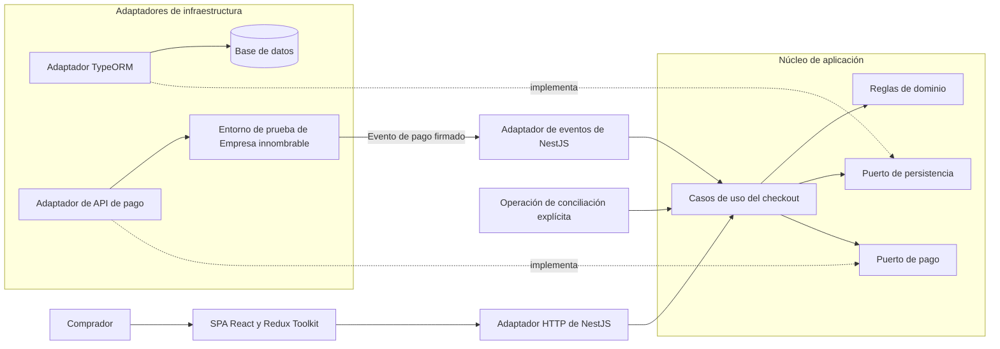
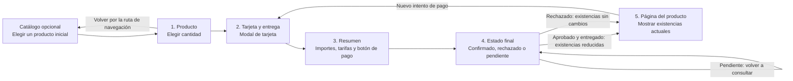
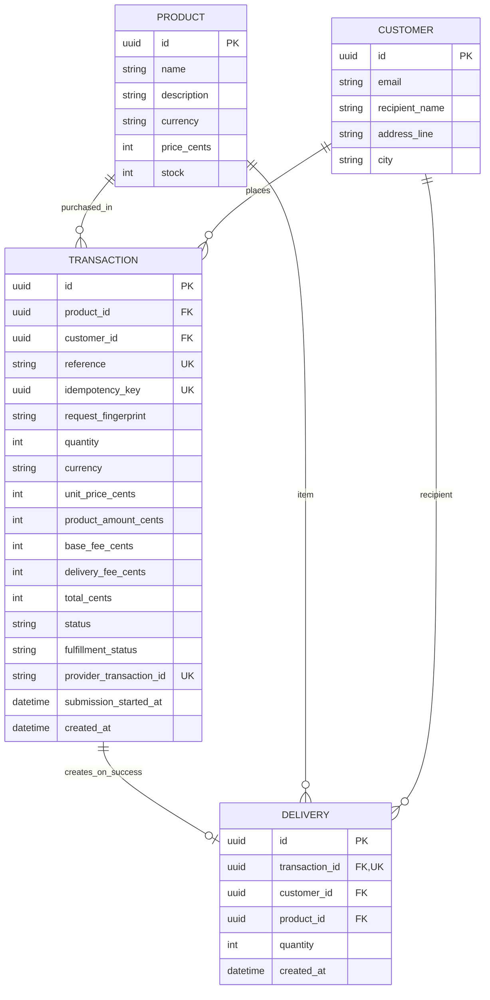
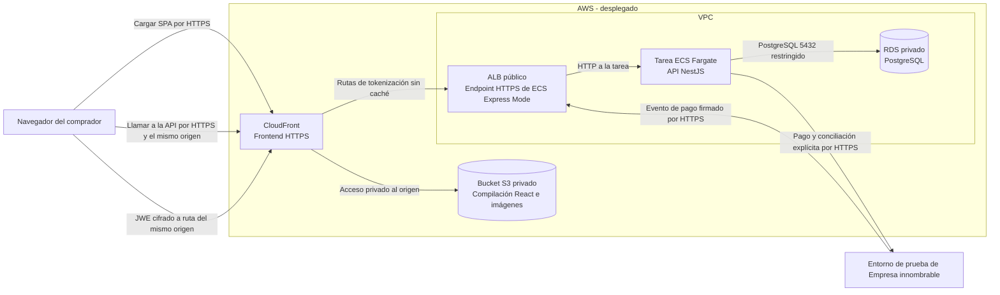

# Pago de productos

Este repositorio contiene una SPA React/Vite y un backend NestJS. La SPA ofrece un catálogo de demostración de diez productos, la compra de un producto a la vez, una cotización calculada por el servidor, una galería de dos vistas, un modal de tarjeta y entrega con consentimientos vigentes separados y tokenización cifrada en el navegador, un resumen de tarifas con confirmación explícita del pago y una pantalla de estado recuperable tras actualizar la página. El backend implementa consultas de productos, inicio idempotente del checkout, verificación de eventos de pago firmados, consulta autoritativa del estado en el servidor, finalización atómica de pagos confirmados, consultas del estado local, conciliación automática acotada de pagos pendientes y conciliación manual del operador para un ID conocido. Consulte la [configuración del frontend](frontend/README.md), la [configuración y el contrato de la API del backend](backend/README.md) y la [colección Postman](docs/product-payment.postman_collection.json). La colección es un archivo del repositorio, no una URL de API alojada: ejecute primero la solicitud de cotización para obtener `expectedTotalCents` y luego proporcione localmente los tokens transitorios del checkout. Nunca exporte ni sincronice la colección con esos valores. Las pruebas locales ejercitan el flujo del navegador con respuestas de red simuladas y el backend con adaptadores simulados y PostgreSQL. Se verificaron el despliegue en AWS, el recorrido público del navegador y una aprobación de pago observada por el usuario en la tienda desplegada. La recepción de eventos firmados en AWS y la creación de la entrega de esa compra no se han comprobado de forma independiente. Los diagramas describen la implementación local y la topología desplegada en la nube.

## 1. Arquitectura de la aplicación (implementada localmente)

Los casos de uso del checkout toman las decisiones de negocio. NestJS traduce las solicitudes del comprador y los eventos de pago firmados; TypeORM y la integración de pagos permanecen fuera del núcleo de aplicación. Las flechas continuas indican llamadas en tiempo de ejecución y las discontinuas, adaptadores que implementan puertos definidos por el núcleo.

PostgreSQL y TypeORM implementan las consultas de productos, la persistencia de checkouts pendientes y los efectos atómicos de pagos confirmados y entregas. El núcleo de aplicación define los contratos de checkout, envío del pago, consulta de estado y finalización, además de la política pura de vinculación de hechos autoritativos, transiciones monótonas y decisiones de entrega. El adaptador TypeORM ejecuta el bloqueo de fila y las escrituras atómicas; los adaptadores HTTP de Nest y de salida se componen en el borde. Están implementadas la recepción de eventos firmados y un mecanismo de conciliación explícita para el operador. La SPA envía el pago únicamente después de la confirmación del comprador y consulta el estado local con la clave de idempotencia original. Las rutas implementadas y sus limitaciones se documentan en el [README del backend](backend/README.md). El núcleo no debe importar NestJS, TypeORM ni tipos del proveedor de pagos.

## 2. Recorrido del comprador (implementado localmente)

El catálogo opcional agrega una manera de elegir entre diez productos cargados inicialmente; no es un carrito ni un paso adicional del checkout. El recorrido requerido sigue teniendo cinco pasos para un único producto seleccionado. El ingreso de la tarjeta ocurre en un modal dentro del segundo paso, no en un paso adicional. Los campos de tarjeta y entrega deben validarse. El comprador elige la cantidad; el servidor conserva la autoridad sobre precio, tarifas, existencias y estado del pago.

Antes del pago, actualizar la página restaura únicamente el ID y la cantidad del producto seleccionado desde una lista permitida validada en `sessionStorage`; se vuelven a consultar el producto y la cotización, y deben introducirse nuevamente los datos de la tarjeta y los consentimientos. Antes del POST de pago, otra lista permitida y versionada guarda el ID, la cantidad y la clave de idempotencia UUIDv4 aleatoria original. Al actualizar la página en el paso de estado, se utiliza esa clave con el `GET /checkouts/status` de solo lectura, nunca con un nuevo POST de pago. Si el almacenamiento es ilegible, se impide un nuevo intento de pago. Nunca se restauran los datos de tarjeta sin cifrar, el token ni la evidencia de consentimiento. Un resultado pendiente o desconocido no debe mostrarse como rechazo ni como entrega exitosa; un pago aprobado sin entrega creada permanece disponible para seguimiento.

## 3. Secuencia de pago y entrega

El resultado verificado del proveedor —no el navegador, un `201` ni un tiempo de espera HTTP— determina la entrega. El backend implementa una consulta autoritativa iniciada por un evento firmado, finalización atómica, estado local de solo lectura, conciliación automática acotada de pendientes y un comando de conciliación separado del operador para un ID de proveedor conocido y vinculado localmente. La SPA envía ahora el pago desde el manejador de confirmación explícita, persiste la clave original antes del POST y realiza como máximo tres consultas automáticas de estado; las consultas posteriores las solicita el comprador. Solo lee **el estado de nuestra API local**. Una respuesta POST perdida o una actualización de página utiliza `GET /checkouts/status` con la misma clave, sin repetir a ciegas el POST. El usuario observó una aprobación en la tienda desplegada; no se verificaron independientemente la entrega de esa compra ni la recepción de eventos firmados en AWS.

```mermaid
sequenceDiagram
    actor Buyer as Comprador
    participant SPA as React SPA
    participant Provider as Empresa innombrable
    participant API as NestJS API
    participant DB as Base de datos

    opt Explorar el catálogo opcional de diez productos
        SPA->>API: GET /products
        API->>DB: Consultar productos y existencias actuales
        DB-->>API: Lista de productos
        API-->>SPA: Lista de productos
        Buyer->>SPA: Elegir un producto
    end
    SPA->>API: GET /products/:id del producto seleccionado
    API->>DB: Consultar producto y existencias actuales
    DB-->>API: Detalle actual del producto
    API-->>SPA: Detalle actual del producto
    Buyer->>SPA: Elegir cantidad de un producto
    SPA->>API: GET /checkout/quote
    API-->>SPA: Cotización calculada por el servidor
    Buyer->>SPA: Ingresar datos de entrega y tarjeta
    SPA->>API: GET /checkout/consents
    API-->>SPA: Enlaces vigentes, tokens de consentimiento y clave pública
    Buyer->>SPA: Aceptar explícitamente ambos documentos vigentes
    SPA->>SPA: Validar tarjeta, entrega y ambos consentimientos
    SPA->>API: GET /checkout/tokenization-key
    API->>Provider: Consultar clave pública de cifrado
    Provider-->>API: Clave pública de cifrado
    API-->>SPA: Solo clave pública de cifrado
    SPA->>SPA: Cifrar datos de tarjeta como JWE compacto
    SPA->>API: POST /checkout/card-tokens solo con JWE compacto
    API->>Provider: Transmitir JWE compacto para tokenización
    Provider-->>API: Token opaco de tarjeta
    API-->>SPA: Solo token opaco de tarjeta
    SPA->>API: GET /checkout/quote antes del resumen
    API-->>SPA: Cotización actualizada calculada por el servidor
    SPA-->>Buyer: Mostrar resumen de tarifas y confirmación final
    Buyer->>SPA: Confirmar y pagar explícitamente
    SPA->>SPA: Guardar clave UUIDv4 original, ID y cantidad en sessionStorage
    SPA->>API: POST /checkouts con token, entrega, expectedTotalCents e Idempotency-Key
    API->>DB: Consultar clave y comparar huella canónica del checkout
    alt Ya existe la misma clave y el mismo checkout
        DB-->>API: Referencia y estado existentes
        API-->>SPA: Devolver resultado existente sin otro cobro
    else Misma clave con otros datos de checkout
        API-->>SPA: Rechazar repetición conflictiva
    else Primer envío
        API->>DB: Consultar producto y existencias canónicos
        API->>API: Validar cantidad y comparar total actual con expectedTotalCents
        alt Cambió el total confirmado
            API-->>SPA: 409 QUOTE_CHANGED sin enviar al proveedor
        else Coincide el total confirmado
        API->>DB: Reservar clave única y guardar cliente y transacción PENDING atómicamente
        API->>DB: Registrar inicio del envío antes de la llamada de red
        API->>Provider: Solicitar pago de prueba con referencia única
        alt El proveedor acusa PENDING
            Provider-->>API: ID del proveedor y estado PENDING inicial
            API->>DB: Vincular ID del proveedor sin degradar estado posterior
            API->>DB: Consultar último estado local tras eventos concurrentes
            API-->>SPA: Referencia y estado actual de transacción
        else Resultado desconocido tras tiempo de espera
            API->>DB: Mantener sin resolver, sin repetir cobro a ciegas
            API-->>SPA: Referencia y estado sin resolver
        end
        end
    end

    Provider-->>API: Actualización de transacción firmada, posiblemente antes de respuesta de pago
    API->>API: Verificar estructura, entorno, suma de comprobación e ID firmado
    API->>Provider: GET de transacción por ID firmado con clave del servidor
    Provider-->>API: ID, referencia, importe, moneda y estado autoritativos
    API->>DB: Bloquear transacción local y vincular hechos autoritativos
    alt APPROVED confirmado y existencias suficientes
        API->>DB: Proteger transición, reducir existencias y crear una entrega atómicamente
        DB-->>API: Pago aprobado y entrega creada
    else APPROVED confirmado sin existencias
        API->>DB: Registrar pago aprobado con entrega pendiente de conciliación
    else Fallo confirmado
        API->>DB: Registrar fallo terminal sin afectar existencias ni entregas
    else Duplicado, antiguo o aún pendiente
        API->>DB: Conservar estado y efectos existentes
    end

    loop Consultas acotadas, consulta manual o actualización del navegador
        SPA->>API: GET /checkouts/status con Idempotency-Key original
        API->>DB: Consultar solo estados de pago y entrega
        DB-->>API: Estado actual
        API-->>SPA: Estado actual sin modificaciones
    end

    opt Volver al producto tras un resultado resuelto y entrega segura
        SPA->>API: GET /products/:id
        API-->>SPA: Existencias actuales, no reducción optimista
    end

    opt Conciliación explícita del operador para un ID vinculado localmente
        API->>DB: Consultar un checkout por referencia local
        API->>Provider: Consultar estado por ID conocido del proveedor en el servidor
        Provider-->>API: Estado actual del proveedor
        API->>API: Aplicar el mismo caso de uso de finalización protegido
    end
```

La idempotencia tiene dos límites. El navegador conserva una clave original por intento confirmado y el backend devuelve una transacción existente cuando coinciden la clave y la huella de los datos de negocio canónicos, incluso si después cambia el precio del producto. Reutilizar la clave con otros datos de compra u otro total esperado produce un conflicto. Un primer envío nuevo con un total del servidor modificado se rechaza antes de persistir o invocar al proveedor. La huella no contiene el token de pago transitorio. Una restricción única de base de datos resuelve primeros envíos concurrentes y un registro duradero del inicio de envío evita que solicitudes concurrentes produzcan otro cobro. Un tiempo de espera después del envío y antes de recibir el ID del proveedor deja el resultado **desconocido**. Un error de referencia única o duplicada no demuestra que un segundo POST al proveedor sea seguro. Un evento firmado puede recuperar el resultado por referencia; de lo contrario, debe conciliarse mediante una capacidad documentada del proveedor o investigación manual, nunca mediante un reintento automático a ciegas. El token de pago es una entrada transitoria, no estado persistido del checkout.

El pago externo y las escrituras en la base de datos local no pueden formar una única transacción. El adaptador de persistencia crea atómicamente los checkouts PENDING y registra de forma duradera un único inicio de envío al proveedor antes de la llamada de red. La finalización utiliza una transacción PostgreSQL: el adaptador TypeORM bloquea la fila de checkout y ejecuta la actualización condicional de existencias y la inserción de una entrega única, mientras una política pura del núcleo decide la vinculación de hechos autoritativos, las transiciones monótonas y los resultados de entrega a partir de los hechos bloqueados. Los eventos duplicados o desordenados no pueden repetir efectos. Un éxito del proveedor que no se pueda persistir sigue siendo elegible para reintentar el evento o conciliar explícitamente; la entrega del evento por sí sola no ofrece garantías ilimitadas. El comando del operador concilia un checkout con un ID de proveedor conocido y vinculado localmente, independientemente del navegador; los intentos sin ID requieren un evento verificado o investigación manual, salvo que se confirme un mecanismo de consulta compatible. El estado del pago y el de la entrega son distintos: un cobro aprobado sin existencias disponibles no implica una entrega. El `GET` de estado local implementado solo lee; nunca llama al proveedor ni escribe efectos de entrega. Los datos de tarjeta sin cifrar nunca deben almacenarse en la base de datos ni en los registros de la aplicación.

El documento de la prueba agrupa las actualizaciones de existencias y entregas tanto en resultados completados como fallidos. La implementación aplica deliberadamente esos efectos solo después de un éxito confirmado; un pago fallido no debe crear una entrega ni reducir las existencias.

La superficie HTTP implementada incluye `GET /products` de solo lectura (una lista con existencias actuales) y `GET /products/:id`, `GET /checkout/quote`, `GET /checkout/consents`, `GET /checkout/tokenization-key`, `POST /checkout/card-tokens`, `POST /checkouts`, `GET /checkouts/status`, `GET /transactions/:reference` y `POST /payment/events` firmado (permanece el `GET /` del proyecto inicial). Los datos de clientes y entregas se gestionan internamente; no se exponen como endpoints CRUD públicos. Ambas consultas de estado requieren la clave de idempotencia original y devuelven únicamente referencia, estado del pago y estado de la entrega; antes de un despliegue público se necesita un control de acceso más sólido. La entrega confirmada es interna; no hay un endpoint CRUD de entregas para compradores. La conciliación es una CLI para el operador, no una ruta pública. La [colección Postman](docs/product-payment.postman_collection.json) es un contrato local con ejemplos de cotización, recuperación y tokenización. Ejecute la cotización justo antes del checkout: su script de respuesta guarda únicamente el entero `totalCents` del servidor como `expectedTotalCents`. Proporcione tokens JWE, de tarjeta y de consentimiento nuevos únicamente en una sesión local y bórrelos antes de exportar; la colección no conserva sus valores. El evento firmado va del proveedor al servidor y deliberadamente no aparece como una solicitud ejecutable de forma manual. La interfaz Swagger local está disponible en `http://localhost:3000/api` y el JSON OpenAPI en `http://localhost:3000/api-json` mientras se ejecuta el backend. Ninguna de las URL es pública.

**Límite de la API para clientes y entregas:** el documento de la prueba exige que la API gestione existencias, transacciones, clientes y entregas, pero no prescribe `GET /customers`, `GET /deliveries` ni rutas CRUD genéricas. El checkout registra el contacto del cliente y los datos de entrega; un pago exitoso verificado crea la entrega y actualiza las existencias de forma atómica. Los endpoints de estado para compradores devuelven deliberadamente solo los estados de pago y entrega, no nombres, correos electrónicos ni direcciones. Los listados públicos de clientes o entregas expondrían datos personales sin un modelo de autenticación de comprador u operador y autorización por objeto, por lo que no se implementaron. Si se necesita una consulta administrativa, deberá ser una API independiente, autorizada y de alcance restringido, no un CRUD sin restricciones.

Evidencia local de Jest del 2026-09-28: en `5d265f15`, `cd frontend && npm run test:coverage -- --runInBand` pasó 127 pruebas en 17 suites, con 92.76% de sentencias, 90.44% de ramas, 95.43% de funciones y 94.96% de líneas. En el árbol de trabajo local posterior del Hito 4, con `CHECKOUT_TEST_DATABASE_URL` apuntando a una base PostgreSQL de prueba desechable, `cd backend && npm run test:cov -- --runInBand --coverageReporters=text-summary` pasó 154 pruebas en 29 suites y midió 87.33% de sentencias, 83.28% de ramas, 83.23% de funciones y 87.99% de líneas. El comando E2E con PostgreSQL pasó 40 pruebas en 6 suites. Compilación y lint pasaron en ambas aplicaciones. La base de datos de prueba desechable se eliminó después. Estas mediciones superan el objetivo estricto de >80% del documento en cada aplicación; no prueban la recepción de eventos desplegada; el usuario verificó por separado un recorrido público hasta la aprobación. Sin una base de datos de prueba configurada, las pruebas PostgreSQL se omiten y la cobertura del backend es menor.

Las pruebas del backend cubren envíos de checkout duplicados y concurrentes, un reenvío con datos modificados, un tiempo de espera previo al ID del proveedor, repetición y desorden de eventos firmados, aprobación tras agotarse las existencias y reversión local ante un fallo al insertar la entrega. Las pruebas unitarias cubren la política de casos de uso; las pruebas de integración PostgreSQL demuestran atomicidad y unicidad. Además de la aprobación local en el entorno de prueba, el usuario observó una aprobación en la tienda AWS. La recepción de eventos desplegada y la entrega de esa compra no se verificaron independientemente; la cobertura Jest de cada aplicación se informa por separado arriba.

## 4. Modelo de datos actual del backend

Este resumen describe el esquema PostgreSQL implementado. Una transacción guarda el producto seleccionado y una instantánea de precios y tarifas. Los datos del destinatario y la dirección permanecen en la fila del cliente mientras el pago está pendiente; **solo existe una fila de entrega después de una aprobación confirmada con existencias suficientes**.

El precio y las existencias definidos como autoridad por el servidor residen en el servidor. Los importes son centavos COP enteros, los ID son UUID y la referencia y clave de idempotencia son únicas. El ID de transacción del proveedor y la marca temporal de inicio del envío pueden ser nulos mientras no se resuelva un intento. El ID de transacción de una entrega es único; la finalización reduce las existencias de forma condicional solo ante una aprobación confirmada con existencias suficientes. Las imágenes estáticas del frontend no forman parte de este esquema.

## Gestión de imágenes (actual)

La SPA sirve dos vistas WebP locales optimizadas por cada uno de los diez productos cargados inicialmente desde `frontend/public/`. `frontend/public/brand-mark.webp` proporciona la marca de la tienda. Un [mapa de ID de producto a imagen](frontend/src/features/checkout/productImages.ts) exclusivo del frontend vincula estos recursos estáticos con los ID iniciales conocidos; PostgreSQL no tiene columna de imagen ni servicio de carga, y la API de productos no devuelve URL de imágenes. Los productos desconocidos muestran un estado de imagen no disponible, no una foto ajena. El catálogo prioriza sus dos primeras imágenes y carga de forma diferida las siguientes; el producto seleccionado presenta una galería con selección de miniaturas y visor de pantalla completa. Las comprobaciones locales en navegador cubrieron diez tarjetas y diseños de 320–1280px frente a NestJS y PostgreSQL, pero no se afirma ninguna garantía de latencia de carga de imágenes en producción.

## 5. Topología de despliegue en AWS

Esta topología se desplegó en `us-east-1` el 28 de septiembre de 2026. El diagrama muestra únicamente tráfico de ejecución. La compilación de React es estática y se sirve desde S3 mediante CloudFront; NestJS se ejecuta en ECS Express Mode y PostgreSQL en RDS no público.

CloudFront utiliza control de acceso al origen para leer el bucket privado y reenvía las rutas de API al endpoint HTTPS de ECS Express Mode, sin caché en las rutas de API. El ALB público solo permite el ingreso a la tarea Fargate por el puerto de NestJS; RDS admite PostgreSQL 5432 únicamente desde el grupo de seguridad de esa tarea. La tarea usa una subred pública de la VPC predeterminada para salir por HTTPS sin puerta de enlace NAT. El navegador cifra la tarjeta antes de enviar el JWE compacto por la ruta del mismo origen. El endpoint de eventos del proveedor llega al ALB por HTTPS y verifica el evento antes de finalizar una compra. Sigue pendiente un límite distribuido o perimetral de abuso: el limitador local por proceso no sustituye esa protección.

La SPA actual solo utiliza la ruta `/`, por lo que no necesita un retorno de rutas profundas a `index.html`. Las credenciales de base de datos y del proveedor están en Secrets Manager, no en la imagen ni en el frontend. La imagen de API incluye el certificado regional de RDS y verifica TLS con `sslmode=verify-full`. La URL de base de datos usa actualmente el usuario maestro; separar un usuario de aplicación con privilegios mínimos y coordinar su rotación queda pendiente antes de tratar este entorno como producción definitiva.

La tienda está en [CloudFront](https://d12hv8vhtndguc.cloudfront.net/) y la documentación de API en el [endpoint HTTPS de ECS](https://sh-7d942072faad4ccf8600cc4f46d59cc7.ecs.us-east-1.on.aws/api). Se verificaron el catálogo en navegador, 10 productos desde RDS, la carga de autorizaciones y las respuestas HTTP 200 de SPA/API. El usuario observó un pago aprobado en la tienda desplegada; no se verificó de forma independiente la fila de entrega de esa compra. La tarea ECS tiene habilitada la conciliación acotada de pagos pendientes y se verificó su arranque y el servicio estable 1/1. El flujo `.github/workflows/deploy-aws.yml` comprueba ambas aplicaciones y, tras un cambio en `develop`, publica ECR/S3, ejecuta migraciones y actualiza ECS mediante OIDC sin claves AWS estáticas; su ejecución #36396234135 (intento 2) finalizó correctamente. El crédito de AWS no garantiza ausencia de cargos: el presupuesto mensual configurado por el usuario es de USD 20, pero no se ha medido aún el costo real de estos recursos.

Referencias de AWS: [origen privado S3 con CloudFront](https://docs.aws.amazon.com/AmazonCloudFront/latest/DeveloperGuide/private-content-restricting-access-to-s3.html), [red y destinos predeterminados de ECS Express Mode](https://docs.aws.amazon.com/AmazonECS/latest/developerguide/express-service-work.html) y [grupos de seguridad de RDS](https://docs.aws.amazon.com/AmazonRDS/latest/gettingstartedguide/security-groups.html).
